<h1 align="center">🛡️ GraphShield</h1>
<h3 align="center">Explainable Graph Neural Network for Financial Fraud Detection</h3>

<p align="center">
  
</p>

<p align="center">
  
  
  
  
  
</p>

<p align="center">
  <strong>GraphShield</strong> models Bitcoin transactions as a directed graph and trains Graph Neural Networks — GCN, GraphSAGE, and GAT — to detect illicit nodes.<br/>
  Predictions are made explainable via <strong>GNNExplainer</strong>, which surfaces the suspicious transaction subgraphs driving each fraud flag.
</p>

---

## 📌 Table of Contents

| Section | Description |
|---|---|
| [Why Graph-Based?](#-why-graph-based) | Motivation over tabular ML |
| [Dataset](#-dataset) | Elliptic Bitcoin dataset statistics |
| [Graph Structure](#-graph-structure) | How nodes and edges are built |
| [Model Architectures](#-model-architectures) | GCN · GraphSAGE · GAT |
| [Results](#-results) | Full comparison table + curves |
| [Ablation Study](#-ablation-study) | Class weights · depth · temporal split |
| [Explainability](#-explainability) | GNNExplainer subgraph + feature importance |
| [Project Structure](#-project-structure) | File tree |
| [Quick Start](#-quick-start) | Install · data · run |
| [Notebook Guide](#-notebook-guide) | What each of the 9 notebooks does |
| [Citation](#-citation) | BibTeX references |

---

## 🔍 Why Graph-Based?

Traditional fraud detection classifies each transaction **independently** using tabular features. Real-world fraud is relational:

- Fraudsters share devices, IP addresses, and merchants across fake accounts
- Money is routed through **rings** of intermediary accounts
- A single transaction looks normal in isolation but is anomalous in its **network context**

Graph Neural Networks propagate information across edges so each node aggregates fraud signals from its neighbourhood — a transaction connected to many known-illicit nodes receives a reinforced fraud signal even if its own features appear benign.

---

## 📊 Dataset

**Elliptic Bitcoin Dataset** — the largest publicly labelled Bitcoin transaction graph ([Weber et al., 2019](https://arxiv.org/abs/1908.02591)).

| Property | Value |
|---|---|
| Source | [Kaggle — ellipticco/elliptic-data-set](https://www.kaggle.com/datasets/ellipticco/elliptic-data-set) |
| Total nodes | 203,769 Bitcoin transactions |
| **Labeled nodes used** | **46,564** |
| Illicit (fraud) | 4,545 — **9.77%** |
| Licit (clean) | 41,941 — **90.23%** |
| **Edges** | **36,624** |
| Node features | 166 (94 local + 72 neighbourhood-aggregated) |
| Time steps | 49 discrete snapshots |
| Train / Val / Test | 29,800 / 7,451 / 9,313 (stratified) |

<p align="center">
  
</p>

---

## 🕸️ Graph Structure

Each **node** = one Bitcoin transaction.  
A directed **edge** u → v means BTC flows from transaction *u* into transaction *v*.

```
[Tx A] ──▶ [Tx C] ──▶ [Tx E]   ← money flow
[Tx B] ──▶ [Tx C]
[Tx D] ──▶ [Tx E]
```

The PyTorch Geometric `Data` object:

```
x           ∈  ℝ^(46564 × 166)    node feature matrix
edge_index  ∈  ℤ^(2 × 36624)      directed edges in COO format
y           ∈  {0, 1}^46564        binary fraud label
```

---

## 🧠 Model Architectures

### GNN Pipeline

```
Node Features  [N × 166]
      │
  ┌───▼────────────────────┐
  │  Message Passing Layer 1│  ← GCNConv / SAGEConv / GATConv(heads=4)
  │  BatchNorm (DeepGCN)   │
  │  ReLU · Dropout p=0.4  │
  └───┬────────────────────┘
      │
  ┌───▼────────────────────┐
  │  Message Passing Layer 2│  ← output dim = 2
  └───┬────────────────────┘
      │
  Softmax ──▶ P(Licit), P(Illicit)
```

### Model Comparison

| Model | Aggregation Strategy | Key Property |
|---|---|---|
| **GCN** | Spectral normalised sum over all neighbours | Fast, strong baseline |
| **GraphSAGE** | Sampled mean over neighbour subset | Inductive · scales to large graphs |
| **GAT** | Learned attention weights (4 heads × 32 dim) | Focuses on most relevant neighbours |
| **DeepGCN** | 3-layer GCN with BatchNorm | Ablation — depth experiment |

### Training Config

```yaml
optimiser:    Adam
lr:           0.001
weight_decay: 5e-4
epochs:       200
loss:         weighted cross-entropy  # inverse-frequency class weights
dropout:      0.4
split:        stratified 64 / 16 / 20 %
```

---

## 📈 Results

### Full Model Comparison

| Model | Accuracy | Precision | Recall | F1 | ROC-AUC | PR-AUC |
|:---|---:|---:|---:|---:|---:|---:|
| Logistic Regression | 0.878 | 0.441 | 0.929 | 0.598 | 0.965 | 0.755 |
| MLP | 0.981 | 0.938 | 0.864 | 0.899 | 0.986 | 0.941 |
| Random Forest | 0.988 | 0.996 | 0.876 | 0.932 | 0.997 | 0.982 |
| LightGBM | 0.993 | 0.987 | 0.937 | 0.962 | **0.998** | **0.990** |
| XGBoost | 0.993 | 0.993 | 0.933 | **0.962** | 0.997 | 0.987 |
| GCN | 0.907 | 0.513 | 0.896 | 0.653 | 0.965 | 0.810 |
| GraphSAGE | 0.936 | 0.618 | 0.899 | 0.732 | 0.977 | 0.900 |
| **GAT** | 0.874 | 0.434 | **0.952** | 0.596 | 0.976 | 0.868 |

> 💡 **GAT achieves the highest recall (0.952) across all 8 models** — it misses the fewest fraud cases.  
> PR-AUC is the primary metric here; accuracy is misleading on a 9.8% fraud rate.

### ROC & PR Curves — GNN Models

<p align="center">
  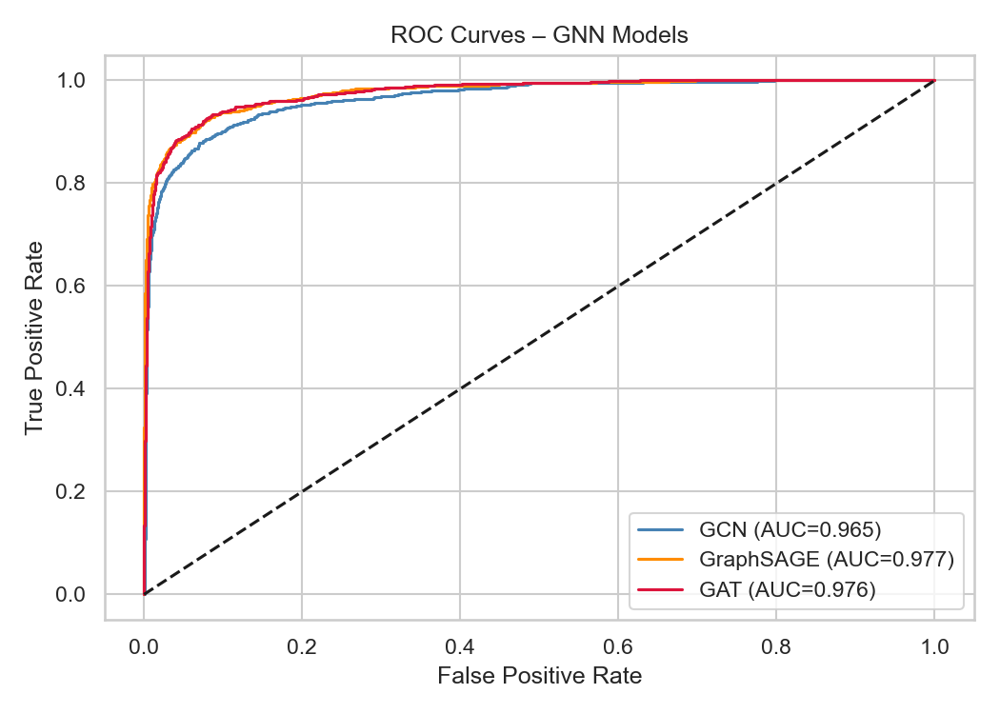
  &nbsp;
  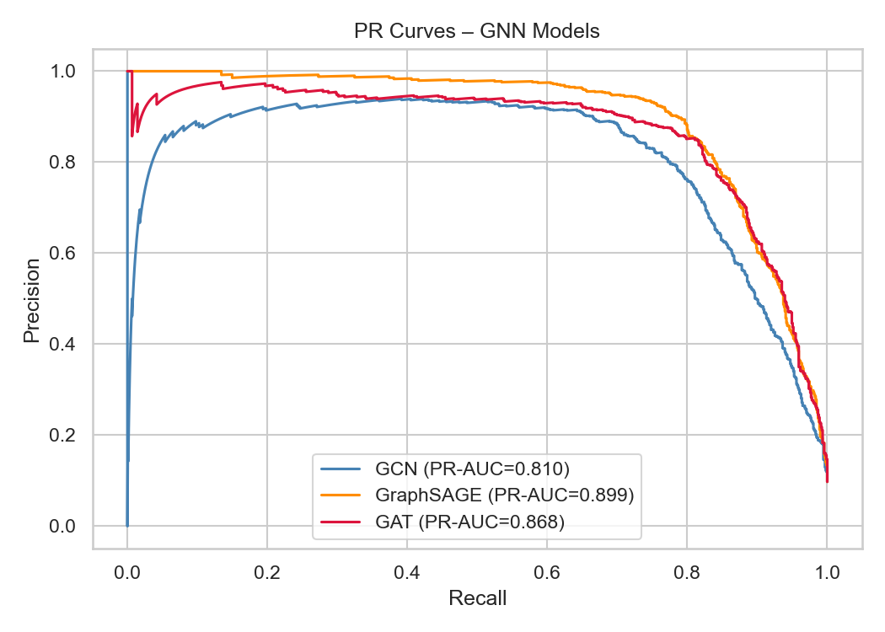
</p>

### Full Model Bar Chart

<p align="center">
  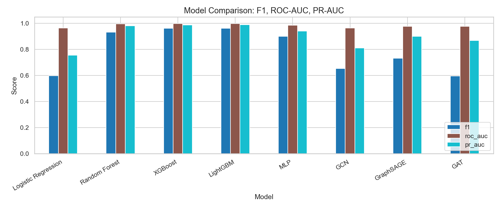
</p>

### Training Loss Curves

<p align="center">
  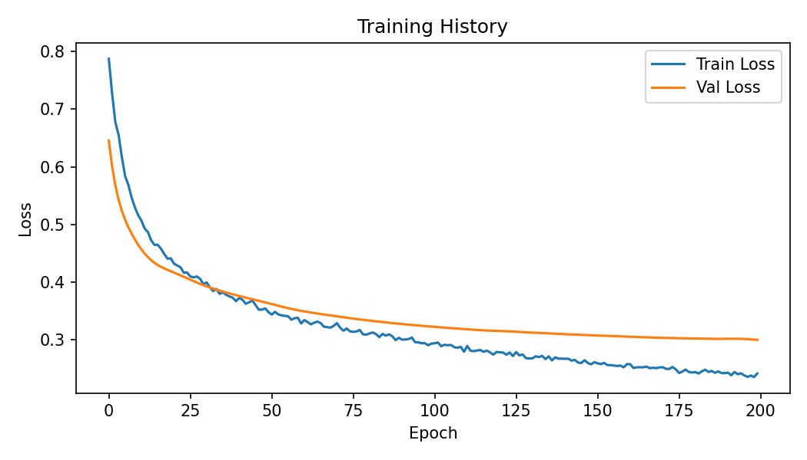
  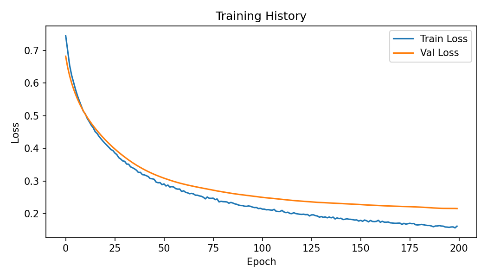
  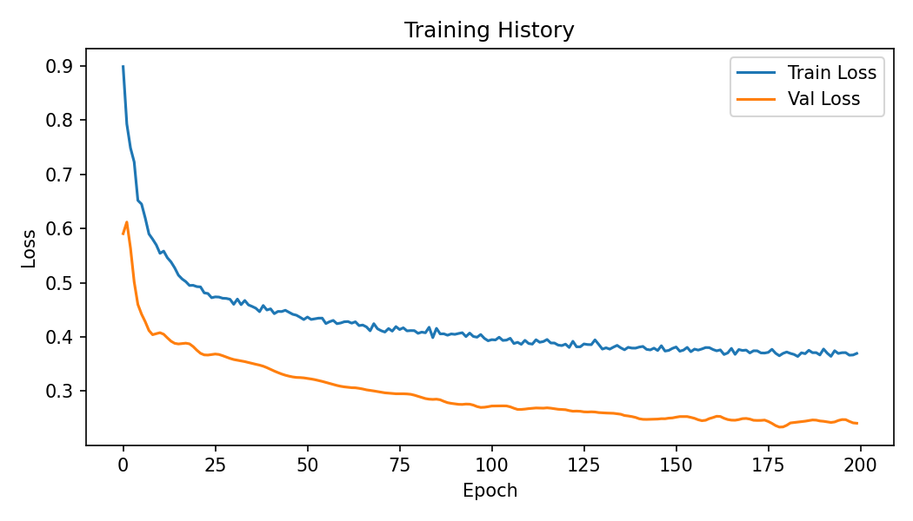
</p>

### Confusion Matrices

<p align="center">
  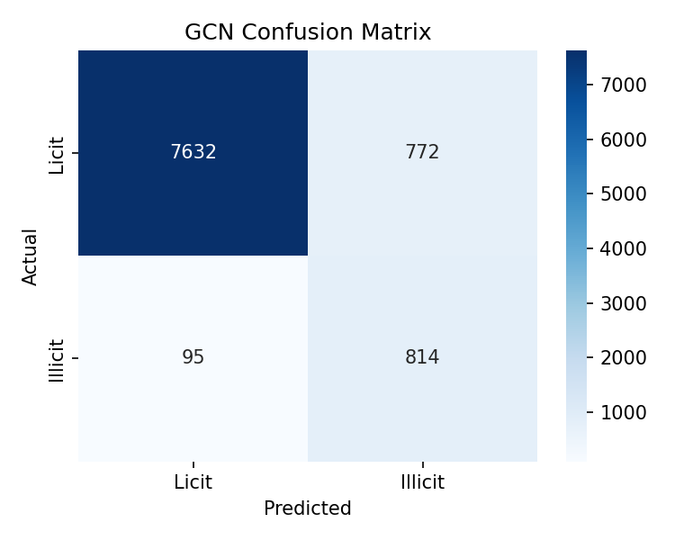
  
  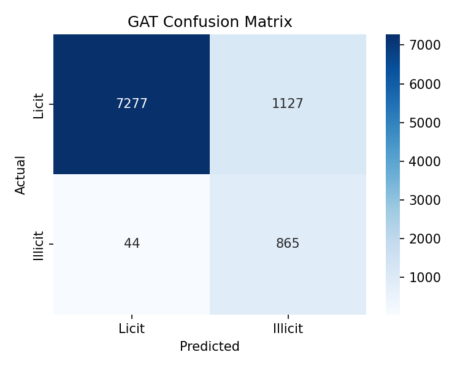
</p>

---

## 🔬 Ablation Study

### Effect of Class Weighting

| Config | F1 | Recall | PR-AUC | ROC-AUC |
|:---|---:|---:|---:|---:|
| GCN + Class Weights | 0.632 | **0.887** | **0.796** | **0.961** |
| GCN − Class Weights | 0.729 | 0.618 | 0.794 | 0.941 |

> Removing weights raises F1 but recall collapses — the model misses 28% more fraud cases.

### Effect of Model Depth

| Config | F1 | Recall | PR-AUC |
|:---|---:|---:|---:|
| GCN 2-Layer | 0.608 | 0.891 | 0.779 |
| GCN 3-Layer | 0.595 | **0.904** | 0.781 |

### Temporal Split (Real-World Simulation)

Train on time steps 1–4 · Test on 5–49

| Split | F1 | PR-AUC |
|:---|---:|---:|
| Random (standard) | 0.632 | 0.796 |
| Temporal | 0.298 | 0.519 |

> Fraud patterns shift across time — random splitting overestimates real-world performance. Temporal GNNs (TGN, TGAT) are the natural next step.

<p align="center">
  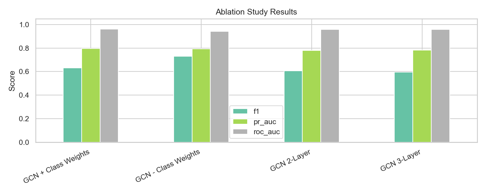
</p>

---

## 💡 Explainability

GNNExplainer is applied to the highest-confidence fraud prediction: **node 7929, fraud probability 0.9994**.

<p align="center">
  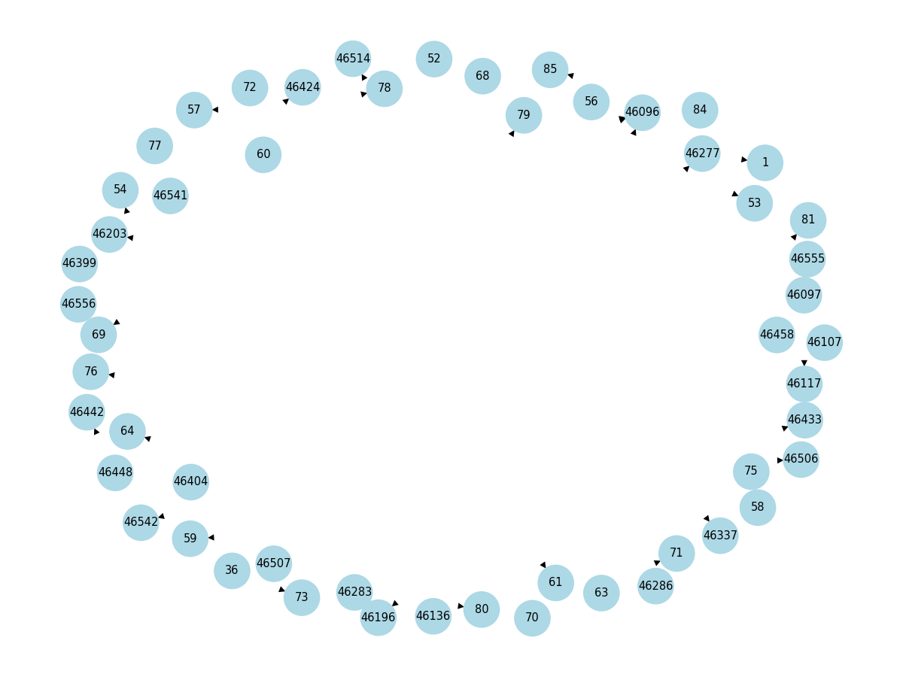
  &nbsp;
  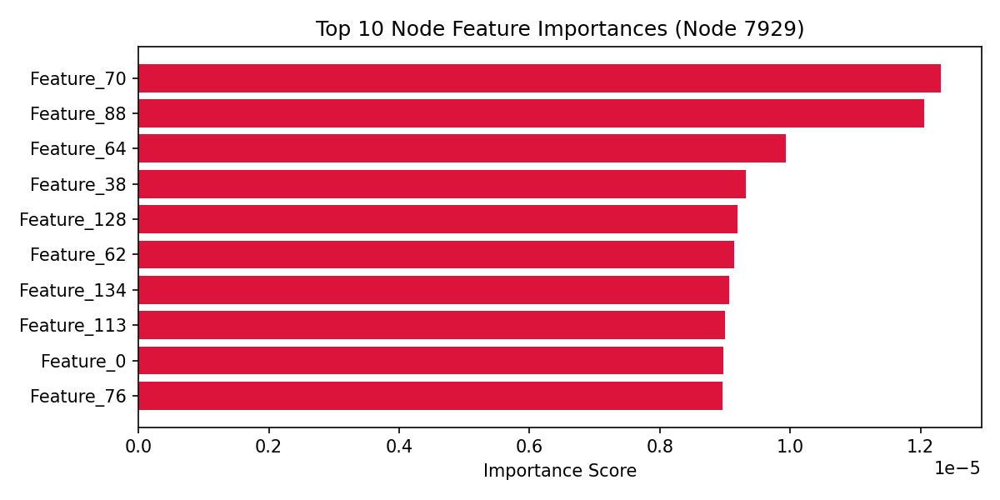
</p>

**What the model sees:**
- Node 7929 is densely connected to a cluster of known illicit nodes (fraud ring)
- Top predictive features are **neighbourhood-aggregated statistics** (features 93–165), not individual transaction amounts
- The explanation subgraph highlights the exact transactions that form the suspicious cluster

This makes GraphShield auditable — a fraud analyst can inspect *why* a transaction was flagged, not just *that* it was flagged.

---

## 📁 Project Structure

```
GraphShield/
│
├── 📂 data/
│   ├── raw/                            ← Elliptic CSVs (download from Kaggle)
│   └── processed/                      ← Generated .pt tensors (notebook 02)
│
├── 📂 notebooks/
│   ├── 01_data_loading_and_eda.ipynb
│   ├── 02_graph_construction.ipynb
│   ├── 03_ml_baseline_models.ipynb
│   ├── 04_gcn_model.ipynb
│   ├── 05_graphsage_model.ipynb
│   ├── 06_gat_model.ipynb
│   ├── 07_model_comparison.ipynb
│   ├── 08_explainability_gnnexplainer.ipynb
│   └── 09_research_results_and_ablation.ipynb
│
├── 📂 src/
│   ├── data_preprocessing.py           ← Load, clean, normalise Elliptic CSVs
│   ├── graph_builder.py                ← Build PyG Data object + masks
│   ├── models.py                       ← GCN · GraphSAGE · GAT · DeepGCN
│   ├── train.py                        ← Training loop with class weights
│   ├── evaluate.py                     ← Metrics · ROC/PR curves · conf matrix
│   ├── explain.py                      ← GNNExplainer wrapper + subgraph viz
│   ├── utils.py                        ← Seed · device · save/load model
│   └── visualize_graph.py              ← Hero graph + dataset overview figures
│
├── 📂 models/
│   ├── gcn_model.pt                    ← Trained GCN weights
│   ├── graphsage_model.pt              ← Trained GraphSAGE weights
│   └── gat_model.pt                    ← Trained GAT weights
│
├── 📂 results/
│   ├── figures/                        ← All 21+ plots and visualisations
│   ├── confusion_matrices/             ← GCN · GraphSAGE · GAT
│   ├── comparison_table.csv
│   ├── baseline_metrics.csv
│   └── ablation_results.csv
│
├── 📂 paper/
│   ├── abstract.md
│   ├── introduction.md
│   ├── literature_review.md
│   ├── methodology.md
│   ├── results.md                      ← Full results with real numbers
│   └── conclusion.md
│
├── config.yaml                         ← All hyperparameters
├── requirements.txt
└── README.md
```

---

## 🚀 Quick Start

### 1. Clone and install

```bash
git clone https://github.com/RiteshKumar2e/GraphShield-Explainable-Graph-Neural-Network-for-Financial-Fraud-Detection.git
cd GraphShield-Explainable-Graph-Neural-Network-for-Financial-Fraud-Detection
pip install -r requirements.txt
```

> **PyTorch Geometric** needs a separate install matched to your CUDA version:
> ```bash
> # CPU-only example
> pip install torch-geometric
> ```
> Full instructions: https://pytorch-geometric.readthedocs.io/en/latest/install/installation.html

### 2. Download the dataset

Go to [Kaggle — Elliptic Bitcoin Dataset](https://www.kaggle.com/datasets/ellipticco/elliptic-data-set) and place all three files in `data/raw/`:

```
data/raw/
├── elliptic_txs_features.csv    ← 658 MB
├── elliptic_txs_classes.csv
└── elliptic_txs_edgelist.csv
```

### 3. Run notebooks in order

```
01 → Explore the data
02 → Build and save the graph (creates data/processed/)
03 → Train ML baselines
04 → Train GCN
05 → Train GraphSAGE
06 → Train GAT
07 → Compare all models
08 → Run GNNExplainer
09 → Ablation study + paper tables
```

### 4. (Optional) Regenerate graph visualisations

```bash
python src/visualize_graph.py
```

---

## 📓 Notebook Guide

| # | Notebook | Purpose |
|---|---|---|
| 01 | Data Loading & EDA | Class imbalance · feature stats · time steps · graph statistics |
| 02 | Graph Construction | PyG `Data` object · stratified masks · save to disk |
| 03 | ML Baselines | LR · RF · XGBoost · LightGBM · MLP — fraud metrics & plots |
| 04 | GCN | 2-layer GCN · class weights · training curves · evaluation |
| 05 | GraphSAGE | Inductive neighbour sampling GNN |
| 06 | GAT | 4-head graph attention network |
| 07 | Model Comparison | Combined ROC/PR curves · full comparison table |
| 08 | GNNExplainer | Explanation subgraph · top 10 feature importances |
| 09 | Ablation Study | Class weights · model depth · temporal split |

---

## 🏆 Key Findings

| Finding | Result |
|---|---|
| 🥇 Highest recall (all models) | **GAT — 0.952** |
| 🥇 Highest F1 (all models) | **XGBoost / LightGBM — 0.962** |
| 🥇 Best GNN (balanced) | **GraphSAGE — F1 0.732 · PR-AUC 0.900** |
| ⚠️ Class weights critical | Recall drops 0.887 → 0.618 without them |
| ⚠️ Temporal gap severe | PR-AUC drops 0.796 → 0.519 under temporal split |
| 🔍 Fraud is structural | Top features are neighbourhood aggregates, not individual tx amounts |

---


## 📄 License

This project is licensed under the **MIT License**.

---

<p align="center">
  Built with &nbsp;
  <a href="https://pytorch.org">PyTorch</a> ·
  <a href="https://pyg.org">PyTorch Geometric</a> ·
  <a href="https://networkx.org">NetworkX</a> ·
  <a href="https://scikit-learn.org">scikit-learn</a>
  <br/><br/>
  <sub>Dataset: <a href="https://www.kaggle.com/datasets/ellipticco/elliptic-data-set">Elliptic Bitcoin Dataset</a> · 46,564 nodes · 36,624 edges · 166 features</sub>
</p>
