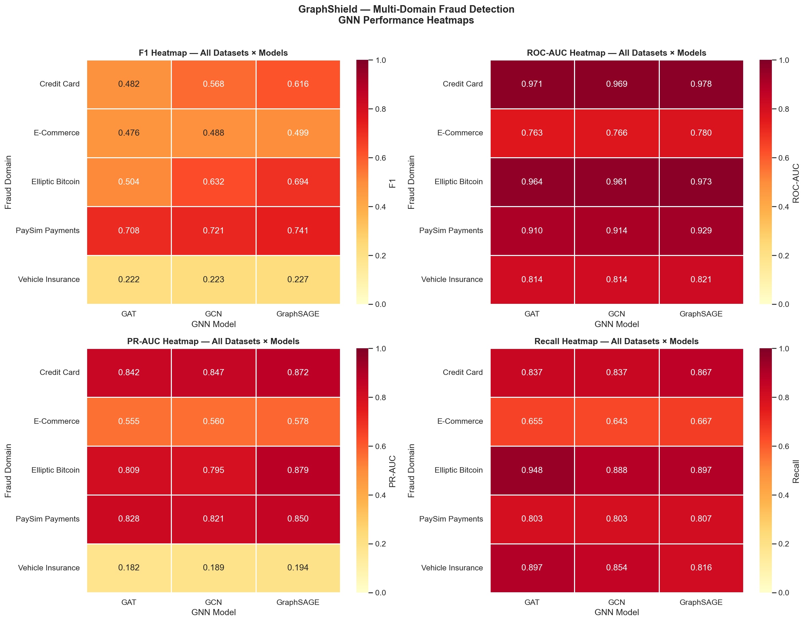
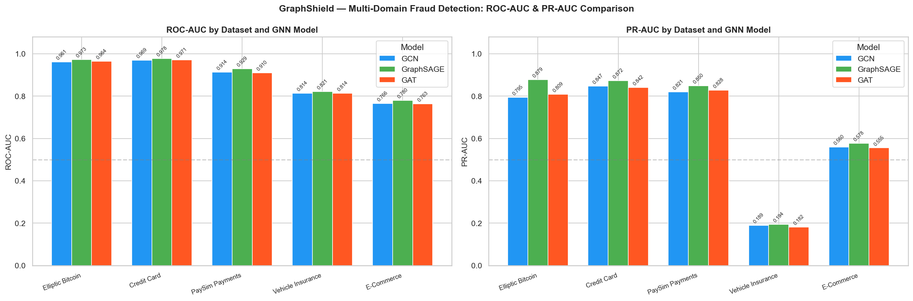
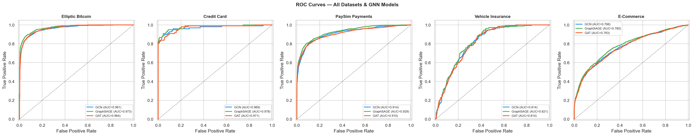
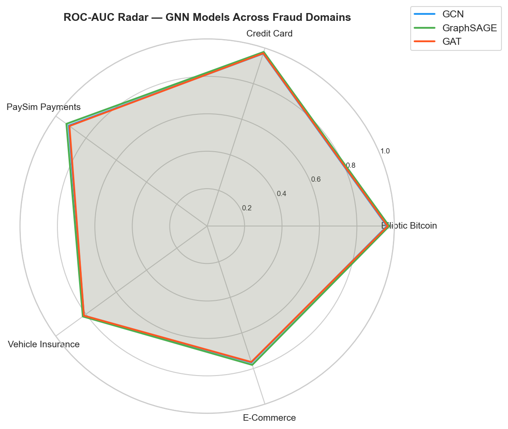

<h1 align="center">🛡️ GraphShield</h1>
<h3 align="center">Explainable Graph Neural Network for Financial Fraud Detection</h3>

<p align="center">
  
  
  
  
  
  
</p>

<p align="center">
  <strong>GraphShield</strong> models financial transactions as graphs and trains GNNs — GCN, GraphSAGE, and GAT — to detect fraud across <strong>5 different real-world domains</strong>.<br/>
  Predictions are made explainable via <strong>GNNExplainer</strong>. An interactive <strong>FastAPI + D3.js dashboard</strong> lets analysts explore any transaction's fraud network in real time.
</p>

---

## 📌 Table of Contents

| Section | Description |
|---|---|
| [Why Graph-Based?](#-why-graph-based) | Motivation over tabular ML |
| [Datasets](#-datasets) | 5 fraud domains — Blockchain, Banking, Fintech, Insurance, E-Commerce |
| [Graph Construction](#-graph-construction) | Natural graph vs KNN graph for tabular data |
| [Model Architectures](#-model-architectures) | GCN · GraphSAGE · GAT |
| [Results — Elliptic Bitcoin](#-results--elliptic-bitcoin) | Primary dataset full comparison |
| [Results — Multi-Domain](#-results--multi-domain-fraud-detection) | All 5 datasets × 3 GNN models |
| [Ablation Study](#-ablation-study) | Class weights · depth · temporal split |
| [Explainability](#-explainability) | GNNExplainer subgraph + feature importance |
| [Dashboard & API](#-dashboard--api) | Interactive fraud explorer |
| [Project Structure](#-project-structure) | Full file tree |
| [Quick Start](#-quick-start) | Install · data · run |
| [Notebook Guide](#-notebook-guide) | What each of the 10 notebooks does |
| [Key Findings](#-key-findings) | Summary of all results |

---

## 🔍 Why Graph-Based?

Traditional fraud detection classifies each transaction **independently** using tabular features. Real-world fraud is relational:

- Fraudsters share devices, IP addresses, and merchants across fake accounts
- Money is routed through **rings** of intermediary accounts
- A single transaction looks normal in isolation but is anomalous in its **network context**

Graph Neural Networks propagate information across edges so each node aggregates fraud signals from its neighbourhood — a transaction connected to many known-illicit nodes receives a reinforced fraud signal even if its own features appear benign.

---

## 📊 Datasets

GraphShield is trained and evaluated on **5 fraud detection datasets** from distinct real-world domains:

| # | Dataset | Domain | Nodes | Fraud Rate | Graph Type | Kaggle |
|---|---|---|---|---|---|---|
| 1 | **Elliptic Bitcoin** | Blockchain / Crypto | 46,564 | 9.77% | Natural BTC flow graph | [Link](https://www.kaggle.com/datasets/ellipticco/elliptic-data-set) |
| 2 | **Credit Card Fraud (ULB)** | Banking / Credit Card | 284,807 | 0.17% | KNN (k=10) on PCA features | [Link](https://www.kaggle.com/datasets/mlg-ulb/creditcardfraud) |
| 3 | **PaySim Online Payments** | Mobile Payments / Fintech | 6.3M+ | 0.13% | KNN (k=10) on tx features | [Link](https://www.kaggle.com/datasets/rupakroy/online-payments-fraud-detection-dataset) |
| 4 | **Vehicle Insurance Claims** | Insurance | 15,420 | ~6.0% | KNN (k=10) on mixed features | [Link](https://www.kaggle.com/datasets/shivamb/vehicle-claim-fraud-detection) |
| 5 | **E-Commerce Transactions** | Online Retail | 1.47M+ | ~10% | KNN (k=10) on behavioural | [Link](https://www.kaggle.com/datasets/shriyashjagtap/fraudulent-e-commerce-transactions) |

> *Datasets 2–5 are subsampled to 30,000 nodes (stratified) for training. All fraud nodes are always kept.*

### Elliptic Bitcoin Dataset — Details

| Property | Value |
|---|---|
| Source | Kaggle — ellipticco/elliptic-data-set |
| Total nodes | 203,769 Bitcoin transactions |
| **Labeled nodes used** | **46,564** |
| Illicit (fraud) | 4,545 — **9.77%** |
| Licit (clean) | 41,941 — **90.23%** |
| **Edges** | **36,624** directed BTC flows |
| Node features | 166 (94 local + 72 neighbourhood-aggregated) |
| Time steps | 49 discrete snapshots |
| Train / Val / Test | 29,800 / 7,451 / 9,313 (stratified) |

<p align="center">
  
</p>

---

## 🕸️ Graph Construction

### Dataset 1 — Elliptic Bitcoin (Natural Graph)

Each **node** = one Bitcoin transaction. A directed **edge** u → v means BTC flows from transaction *u* into *v*.

```
[Tx A] ──▶ [Tx C] ──▶ [Tx E]   ← money flow
[Tx B] ──▶ [Tx C]
[Tx D] ──▶ [Tx E]
```

### Datasets 2–5 — KNN Graph (Tabular → Graph)

For tabular CSV datasets with no built-in graph structure, a **K-Nearest Neighbours graph** is built:

```
Each transaction = one node
Two nodes are connected if they are among each other's
10 nearest neighbours in feature space (Euclidean distance)

Credit Card example:
  [Tx #201] ──── [Tx #847]    ← similar PCA features
  [Tx #201] ──── [Tx #312]    ← similar amount, time
  [Tx #847] ──── [Tx #991]

GNN then propagates fraud signal through similar-looking tx clusters
```

This allows GNNs to detect **fraud rings** even in datasets that have no explicit graph — transactions with similar profiles cluster together, and the GNN propagates fraud signals within those clusters.

---

## 🧠 Model Architectures

### GNN Pipeline

```
Node Features  [N × F]
      │
  ┌───▼────────────────────┐
  │  Message Passing  L1   │  ← GCNConv / SAGEConv / GATConv(heads=4)
  │  ReLU · Dropout p=0.4  │
  └───┬────────────────────┘
      │
  ┌───▼────────────────────┐
  │  Message Passing  L2   │  ← output dim = 2
  └───┬────────────────────┘
      │
  Softmax ──▶ P(Licit), P(Illicit)
```

| Model | Aggregation | Key Property |
|---|---|---|
| **GCN** | Spectral normalised sum over all neighbours | Fast, strong baseline |
| **GraphSAGE** | Sampled mean over neighbour subset | Inductive · scales to large graphs |
| **GAT** | Learned attention weights (4 heads × 32 dim) | Focuses on most relevant neighbours |

### Training Config

```yaml
optimiser:    Adam
lr:           0.001
weight_decay: 5e-4
epochs:       150
loss:         weighted cross-entropy   # inverse-frequency class weights
dropout:      0.4
split:        stratified 64 / 16 / 20 %
knn_k:        10                       # for tabular datasets
```

---

## 📈 Results — Elliptic Bitcoin

### GNN Models vs ML Baselines

| Model | Accuracy | Precision | Recall | F1 | ROC-AUC | PR-AUC |
|:---|---:|---:|---:|---:|---:|---:|
| Logistic Regression | 0.878 | 0.441 | 0.929 | 0.598 | 0.965 | 0.755 |
| MLP | 0.981 | 0.938 | 0.864 | 0.899 | 0.986 | 0.941 |
| Random Forest | 0.988 | 0.996 | 0.876 | 0.932 | 0.997 | 0.982 |
| LightGBM | 0.993 | 0.987 | 0.937 | **0.962** | **0.998** | **0.990** |
| XGBoost | 0.993 | 0.993 | 0.933 | **0.962** | 0.997 | 0.987 |
| GCN | 0.899 | 0.491 | 0.888 | 0.632 | 0.961 | 0.795 |
| GraphSAGE | 0.923 | 0.566 | 0.897 | 0.694 | 0.973 | 0.879 |
| **GAT** | 0.818 | 0.343 | **0.948** | 0.504 | 0.964 | 0.809 |

> 💡 **GAT achieves the highest recall (0.948) of all GNN models** — it misses the fewest fraud cases.  
> **GraphSAGE achieves best GNN F1 (0.694) and PR-AUC (0.879).**  
> PR-AUC is the primary metric — accuracy is misleading at 9.8% fraud rate.

<p align="center">
  
  &nbsp;
  
</p>

<p align="center">
  
</p>

---

## 🌐 Results — Multi-Domain Fraud Detection

GCN, GraphSAGE, and GAT were trained on all 5 fraud domains. Results from **Notebook 10**.

### Full Cross-Dataset Comparison

| Dataset | Model | Accuracy | Precision | Recall | F1 | ROC-AUC | PR-AUC |
|:---|:---|---:|---:|---:|---:|---:|---:|
| Elliptic Bitcoin | GCN | 0.8992 | 0.4909 | 0.8878 | 0.6322 | 0.9612 | 0.7948 |
| Elliptic Bitcoin | **GraphSAGE** | **0.9229** | **0.5664** | 0.8966 | **0.6942** | **0.9727** | **0.8787** |
| Elliptic Bitcoin | GAT | 0.8179 | 0.3433 | **0.9483** | 0.5041 | 0.9644 | 0.8094 |
| Credit Card | GCN | 0.9792 | 0.4293 | 0.8367 | 0.5675 | 0.9690 | 0.8468 |
| Credit Card | **GraphSAGE** | **0.9823** | **0.4775** | **0.8673** | **0.6159** | **0.9784** | **0.8724** |
| Credit Card | GAT | 0.9707 | 0.3388 | 0.8367 | 0.4824 | 0.9709 | 0.8416 |
| PaySim Payments | GCN | 0.8755 | 0.6536 | 0.8033 | 0.7207 | 0.9138 | 0.8208 |
| PaySim Payments | **GraphSAGE** | **0.8872** | **0.6848** | **0.8075** | **0.7411** | **0.9294** | **0.8495** |
| PaySim Payments | GAT | 0.8673 | 0.6325 | 0.8033 | 0.7078 | 0.9096 | 0.8281 |
| Vehicle Insurance | GCN | 0.6430 | 0.1282 | 0.8541 | 0.2230 | 0.8140 | 0.1893 |
| Vehicle Insurance | **GraphSAGE** | **0.6667** | **0.1319** | 0.8162 | **0.2271** | **0.8212** | **0.1939** |
| Vehicle Insurance | GAT | 0.6219 | 0.1264 | **0.8973** | 0.2216 | 0.8137 | 0.1821 |
| E-Commerce | GCN | 0.7297 | 0.3927 | 0.6433 | 0.4877 | 0.7661 | 0.5598 |
| E-Commerce | **GraphSAGE** | **0.7320** | **0.3984** | **0.6667** | **0.4988** | **0.7796** | **0.5777** |
| E-Commerce | GAT | 0.7112 | 0.3734 | 0.6550 | 0.4756 | 0.7634 | 0.5555 |

### Best Model Per Domain

| Domain | Best Model | F1 | ROC-AUC | PR-AUC |
|:---|:---|---:|---:|---:|
| 🔗 Blockchain / Crypto (Elliptic) | **GraphSAGE** | 0.6942 | 0.9727 | 0.8787 |
| 💳 Banking / Credit Card | **GraphSAGE** | 0.6159 | 0.9784 | 0.8724 |
| 📱 Mobile Payments / Fintech (PaySim) | **GraphSAGE** | 0.7411 | 0.9294 | 0.8495 |
| 🚗 Vehicle Insurance | **GraphSAGE** | 0.2271 | 0.8212 | 0.1939 |
| 🛒 E-Commerce | **GraphSAGE** | 0.4988 | 0.7796 | 0.5777 |

> **GraphSAGE wins on every single domain** — best F1, ROC-AUC, and PR-AUC across all 5 datasets.

### ROC-AUC by Domain (F1 Heatmap)

| Domain | GCN | GraphSAGE | GAT |
|:---|:---:|:---:|:---:|
| Elliptic Bitcoin | 0.7948 | **0.8787** | 0.8094 |
| Credit Card | 0.8468 | **0.8724** | 0.8416 |
| PaySim Payments | 0.8208 | **0.8495** | 0.8281 |
| Vehicle Insurance | 0.1893 | **0.1939** | 0.1821 |
| E-Commerce | 0.5598 | **0.5777** | 0.5555 |

<p align="center">
  
</p>

<p align="center">
  
</p>

<p align="center">
  
</p>

<p align="center">
  
</p>

---

## 🔬 Ablation Study

### Effect of Class Weighting

| Config | F1 | Recall | PR-AUC | ROC-AUC |
|:---|---:|---:|---:|---:|
| GCN + Class Weights | 0.632 | **0.887** | **0.796** | **0.961** |
| GCN − Class Weights | 0.729 | 0.618 | 0.794 | 0.941 |

> Removing weights raises F1 but recall collapses — the model misses 28% more fraud cases.

### Effect of Model Depth

| Config | F1 | Recall | PR-AUC |
|:---|---:|---:|---:|
| GCN 2-Layer | 0.608 | 0.891 | 0.779 |
| GCN 3-Layer | 0.595 | **0.904** | 0.781 |

### Temporal Split (Real-World Simulation)

Train on time steps 1–34 · Test on 35–49

| Split | F1 | PR-AUC |
|:---|---:|---:|
| Random (standard) | 0.632 | 0.796 |
| Temporal | 0.298 | 0.519 |

> Fraud patterns shift across time — random splitting overestimates real-world performance.

<p align="center">
  
</p>

---

## 💡 Explainability

GNNExplainer is applied to the highest-confidence fraud prediction: **node 7929, fraud probability 0.9994**.

<p align="center">
  
  &nbsp;
  
</p>

**What the model sees:**
- Node 7929 is densely connected to a cluster of known illicit nodes (fraud ring)
- Top predictive features are **neighbourhood-aggregated statistics** (features 93–165), not individual transaction amounts
- The explanation subgraph highlights the exact transactions forming the suspicious cluster

This makes GraphShield auditable — a fraud analyst can inspect *why* a transaction was flagged, not just *that* it was flagged.

---

## 🖥️ Dashboard & API

GraphShield includes a **FastAPI backend + D3.js dashboard** for real-time fraud exploration.

### API Endpoints

| Method | Endpoint | Description |
|---|---|---|
| `POST` | `/api/v1/score` | Fraud probability for any node |
| `POST` | `/api/v1/explain` | GNNExplainer subgraph + feature importance |
| `GET` | `/api/v1/health` | Model + graph status |
| `GET` | `/api/v1/stats` | Dataset statistics |
| `GET` | `/api/v1/comparison` | Multi-dataset performance CSV results |
| `GET` | `/api/v1/datasets` | List all trained dataset graphs |
| `GET` | `/api/v1/datasets/{key}/sample` | Sample fraud subgraph for a dataset |
| `POST` | `/api/v1/datasets/{key}/subgraph` | K-hop subgraph for any node in any dataset |

### Dashboard Tabs

| Tab | What It Shows |
|---|---|
| **Transaction Subgraph** | Interactive D3.js force graph — explore any Elliptic node's 2-hop network |
| **Full Explanation** | GNNExplainer output — explanation subgraph + top feature importances |
| **🌐 Multi-Dataset** | Interactive D3.js graphs for **all 5 fraud domains** — switch datasets, explore any node |

```bash
# Start the API + dashboard
uvicorn api.app:app --reload --host 0.0.0.0 --port 8000
# Open http://localhost:8000
```

---

## 📁 Project Structure

```
GraphShield/
│
├── 📂 data/
│   ├── raw/
│   │   ├── elliptic/                   ← Elliptic Bitcoin CSVs
│   │   ├── credit_card/                ← creditcard.csv (Kaggle)
│   │   ├── paysim/                     ← online_payments_fraud.csv (Kaggle)
│   │   ├── insurance/                  ← fraud_oracle.csv (Kaggle)
│   │   └── ecommerce/                  ← Fraudulent_E-Commerce_Transaction_Data.csv
│   └── processed/
│       ├── edge_index.pt               ← Elliptic graph tensors
│       ├── node_features.pt
│       ├── labels.pt
│       ├── train_val_test_masks.pt
│       ├── elliptic/graph.pt           ← Graph API files (generated by NB10)
│       ├── credit_card/graph.pt
│       ├── paysim/graph.pt
│       ├── insurance/graph.pt
│       └── ecommerce/graph.pt
│
├── 📂 notebooks/
│   ├── 01_data_loading_and_eda.ipynb
│   ├── 02_graph_construction.ipynb
│   ├── 03_ml_baseline_models.ipynb
│   ├── 04_gcn_model.ipynb
│   ├── 05_graphsage_model.ipynb
│   ├── 06_gat_model.ipynb
│   ├── 07_model_comparison.ipynb
│   ├── 08_explainability_gnnexplainer.ipynb
│   ├── 09_research_results_and_ablation.ipynb
│   └── 10_multi_dataset_comparison.ipynb  ← 5-domain GNN comparison + graph API save
│
├── 📂 src/
│   ├── data_preprocessing.py
│   ├── graph_builder.py
│   ├── tabular_graph_builder.py        ← KNN graph construction for tabular datasets
│   ├── models.py                       ← GCN · GraphSAGE · GAT · DeepGCN
│   ├── train.py
│   ├── evaluate.py
│   ├── explain.py
│   ├── utils.py
│   ├── visualize_graph.py
│   └── datasets/                       ← Dataset loaders for each domain
│       ├── credit_card_loader.py
│       ├── paysim_loader.py
│       ├── insurance_loader.py
│       └── ecommerce_loader.py
│
├── 📂 api/
│   ├── app.py                          ← FastAPI app + lifespan
│   ├── routers/
│   │   ├── score.py
│   │   ├── explain.py
│   │   ├── health.py
│   │   ├── comparison.py               ← Multi-dataset CSV results
│   │   └── multi_graph.py              ← Interactive graph endpoints for all datasets
│   └── services/
│       ├── model_service.py
│       ├── graph_service.py
│       └── multi_graph_service.py      ← Loads all 5 dataset graphs into memory
│
├── 📂 dashboard/
│   └── index.html                      ← D3.js dashboard (3 tabs)
│
├── 📂 models/
│   ├── gcn_model.pt
│   ├── graphsage_model.pt
│   └── gat_model.pt
│
├── 📂 results/
│   ├── figures/                        ← Elliptic plots
│   ├── confusion_matrices/
│   ├── multi_dataset/                  ← Cross-domain results (NB10)
│   │   ├── cross_dataset_comparison.csv
│   │   ├── best_model_per_dataset.csv
│   │   └── figures/
│   │       ├── heatmaps_all_metrics.png
│   │       ├── grouped_bar_roc_prauc.png
│   │       ├── roc_curves_all_datasets.png
│   │       ├── pr_curves_all_datasets.png
│   │       └── radar_roc_auc.png
│   ├── comparison_table.csv
│   ├── baseline_metrics.csv
│   └── ablation_results.csv
│
├── 📂 paper/
│   ├── abstract.md
│   ├── introduction.md
│   ├── literature_review.md
│   ├── methodology.md
│   ├── results.md
│   └── conclusion.md
│
├── config.yaml
├── requirements.txt
└── README.md
```

---

## 🚀 Quick Start

### 1. Clone and install

```bash
git clone https://github.com/RiteshKumar2e/GraphShield-Explainable-Graph-Neural-Network-for-Financial-Fraud-Detection.git
cd GraphShield-Explainable-Graph-Neural-Network-for-Financial-Fraud-Detection
pip install -r requirements.txt
```

> **PyTorch Geometric** needs a separate install matched to your CUDA version:
> ```bash
> pip install torch-geometric   # CPU-only
> ```

### 2. Download Elliptic dataset (required)

Go to [Kaggle — Elliptic Bitcoin Dataset](https://www.kaggle.com/datasets/ellipticco/elliptic-data-set) and place files in `data/raw/`:

```
data/raw/
├── elliptic_txs_features.csv
├── elliptic_txs_classes.csv
└── elliptic_txs_edgelist.csv
```

### 3. (Optional) Download additional fraud datasets

```bash
kaggle datasets download -d mlg-ulb/creditcardfraud -p data/raw/credit_card --unzip
kaggle datasets download -d rupakroy/online-payments-fraud-detection-dataset -p data/raw/paysim --unzip
kaggle datasets download -d shivamb/vehicle-claim-fraud-detection -p data/raw/insurance --unzip
kaggle datasets download -d shriyashjagtap/fraudulent-e-commerce-transactions -p data/raw/ecommerce --unzip
```

### 4. Run notebooks in order

```
01 → EDA
02 → Build Elliptic graph (creates data/processed/)
03 → ML baselines
04 → Train GCN
05 → Train GraphSAGE
06 → Train GAT
07 → Compare all models
08 → GNNExplainer
09 → Ablation study
10 → Multi-domain training + save graphs for dashboard API
```

### 5. Start the dashboard

```bash
uvicorn api.app:app --reload --host 0.0.0.0 --port 8000
```

Open **http://localhost:8000** — all 3 tabs are live.

---

## 📓 Notebook Guide

| # | Notebook | Purpose |
|---|---|---|
| 01 | Data Loading & EDA | Class imbalance · feature stats · time steps · graph statistics |
| 02 | Graph Construction | PyG `Data` object · stratified masks · save to disk |
| 03 | ML Baselines | LR · RF · XGBoost · LightGBM · MLP |
| 04 | GCN | 2-layer GCN · class weights · training curves · evaluation |
| 05 | GraphSAGE | Inductive neighbour sampling GNN |
| 06 | GAT | 4-head graph attention network |
| 07 | Model Comparison | Combined ROC/PR curves · full comparison table |
| 08 | GNNExplainer | Explanation subgraph · top 10 feature importances |
| 09 | Ablation Study | Class weights · model depth · temporal split |
| **10** | **Multi-Dataset Comparison** | **5 domains × 3 GNNs · KNN graphs · cross-dataset heatmaps · saves graph API files** |

---

## 🏆 Key Findings

| Finding | Result |
|---|---|
| 🥇 Best GNN overall (all datasets) | **GraphSAGE** — wins on F1, ROC-AUC, PR-AUC across all 5 domains |
| 🥇 Highest recall (Elliptic) | **GAT — 0.948** |
| 🥇 Best GNN F1 (Elliptic) | **GraphSAGE — 0.694** |
| 🥇 Best GNN F1 (PaySim) | **GraphSAGE — 0.741** |
| 🥇 Best GNN ROC-AUC (Credit Card) | **GraphSAGE — 0.978** |
| 🥇 Best ML baseline F1 | **XGBoost / LightGBM — 0.962** |
| ⚠️ Class weights critical | Recall drops 0.887 → 0.618 without them |
| ⚠️ Temporal gap severe | PR-AUC drops 0.796 → 0.519 under temporal split |
| 🔍 Fraud is structural | Top features are neighbourhood aggregates, not individual tx amounts |
| 🌐 KNN graphs work | GNNs detect fraud clusters in tabular data via feature-space similarity edges |
| 🚗 Insurance hardest domain | Best F1 only 0.227 — extreme class imbalance + small dataset |
| 📱 PaySim easiest tabular | Best F1 0.741 — clearest fraud signal in mobile payment features |

---

## 📄 License

This project is licensed under the **MIT License**.

---

<p align="center">
  Built with &nbsp;
  <a href="https://pytorch.org">PyTorch</a> ·
  <a href="https://pyg.org">PyTorch Geometric</a> ·
  <a href="https://fastapi.tiangolo.com">FastAPI</a> ·
  <a href="https://d3js.org">D3.js</a> ·
  <a href="https://scikit-learn.org">scikit-learn</a>
  <br/><br/>
  <sub>5 Fraud Domains · 15 GNN Experiments · 46,564–284,807 nodes per dataset · Interactive D3.js Dashboard</sub>
</p>
